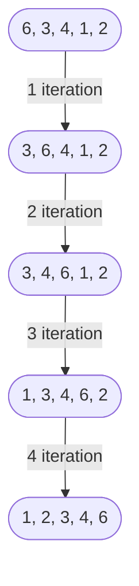

# Sorting
<p> Basically there are 5 sorting algorithm and rest are derived from them.</p>
1. Insertion Sort<br>
1. Bubble Sort<br>
1. Selection Sort<br>
1. Merge Sort<br>
1. Quick Sort<br>
<hr>

## 1. Insertion Sort
<p>In **insertion sort**, we use two loop generally i.e <br>
<pre>
1. for loop: Started from position ~~0~~ 1
|    2. while loop(nested)
</pre>
In this sorting algorithm the given array is getting sorted upto the position of first iteration. The elements antecedent that position is sorted. For next iteration the pointer move to next element and the array get sorted upto that position and its goes on. The for loop commit **n-1** iteration and while loop did **i-1** iteration in each for loop iteration.
<p>

> **Code**

```py
def insertion_sort(array):
    
    for i in range(1,len(array)):
        temp = array[i]
        j=i-1
        while(temp<array[j] and j>=0):
            array[j+1] = array[j]
            j =j-1
        array[j+1] = temp

    return array    

arr= [6,3,4,1,2]
z=insertion_sort(arr)
print("Insertion_sort: ",z)
```
> **Output**

```
Insertion_sort: [1,2,3,4,6]
```
> **Visual Representation**

<hr>


## 2. Bubble Sorting

<p>
In **Bubble Sort** we use two loop i.e.
<pre>
1. for loop: traverse complete array.
|    2. for loop(nested): traverse one element less       
|    |    from the end.
|    |    | if :
</pre>
It sort element in bubble. Bubble contain atmost two element at a time and compair them and sorted. It started with first two element and then second and third and so on.

After completing the first iteration of for loop(not nested one) most of the element take the correct position.

</p>

> **Code**
```py
def bubble_sort(array):
  
    for i in range(len(array)):
        for j in range(len(array)-1):
            if array[j]>array[j+1]:
                array[j],array[j+1]=array[j+1],array[j]
                

    return array    

arr= [6,3,4,1,2]
arr=bubble_sort(arr)
print("Bubble Sort: ", arr)
```

> **Output**
```
Bubble Sort: [1,2,3,4,6]
```
> **Visual Representation**


<br>

## 2.1 Optimise Bubble Sort
<p>
An **flag** element is introduce inside first for loop, whose initial value is "0". If nested loop conditional statement execute the value of **flag** changed then loop work as typical bubble sort.

<pre>
1. for loop: traverse complete array.
|    2. for loop(nested): traverse one element less       
|    |    from the end.
|    |    | if :
|     if : break
</pre>

For a condition the nested for loop conditional statement does not execute than the flag value is unchanged. After completing nested loop the pointer executed the conditional statement of first for loop and break it.  


</p>

> **Code**
```py
def optimize_bubble_sort(array):

    for i in range(len(array)):
        flag =0
        for j in range(len(array)-1):
            if array[j]>array[j+1]:
                temp = array[j]
                array[j]=array[j+1]
                array[j+1]=temp
                flag=1
        if flag == 0:
            break
    return array


arr= [6,3,4,1,2]
arr = optimize_bubble_sort(arr)
print("Optimize Bubble Sort: ",arr)
```

> **Output**
```
Bubble Sort: [1,2,3,4,6]
```
> **Visual Representation**


<hr>

## 3. Selection Sort
<p>

</p>

> **Code**
```py

```

> **Output**
```

```
> **Visual Representation**

```mermaid

```
<hr>

## 4. Merge Sort
<p>

</p>

> **Code**
```py

```

> **Output**
```

```
> **Visual Representation**

```mermaid

```
<hr>

## 5. Quick Sort

<p>

</p>

> **Code**
```py

```

> **Output**
```

```
> **Visual Representation**

```mermaid

```
<hr>