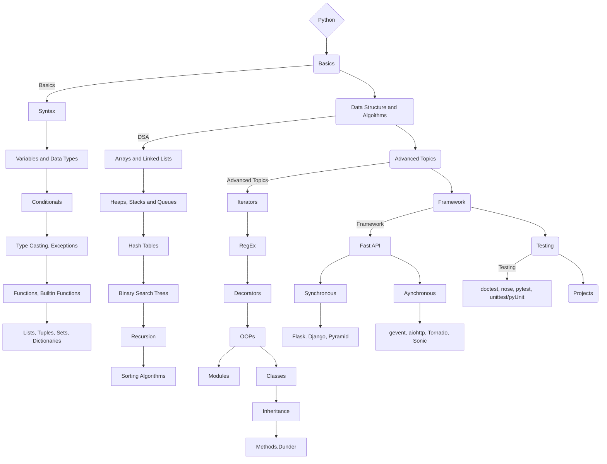

# Python
Author: Hridaye

```mermaid
graph TD;

    A{Python}-->B(Basics)

    B-->|Basics| B1[Syntax]-->B2[Variables and Data Types]-->B3[Conditionals]-->B4[Type Casting, Exceptions]-->B5[Functions, Builtin Functions]-->B6[Lists, Tuples, Sets, Dictionaries]

    B --> C(Data Structure and Algoithms)
    C-->|DSA|C1[Arrays and Linked Lists]-->C2[Heaps, Stacks and Queues]-->C3[Hash Tables]-->C4[Binary Search Trees]-->C5[Recursion]-->C6[Sorting Algorithms]

    C --> D(Advanced Topics)
    D -->|Advanced Topics|D1[Iterators]-->D2[RegEx]-->D3[Decorators]-->D4[OOPs]-->D5[Modules]
    D4-->D41[Classes]-->D42[Inheritance]-->D43[Methods,Dunder]

    D --> E(Framework)-->|Framework| E1[Fast API]-->E11[Synchronous]-->E12[Flask, Django, Pyramid]
    E1-->E22[Aynchronous]-->E23[gevent, aiohttp, Tornado, Sonic]

    E --> F(Testing)-->|Testing|F1[doctest, nose, pytest, unittest/pyUnit]
    F --> G(Projects)
```

